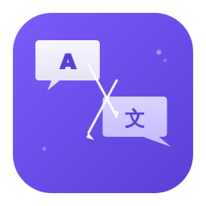

# DotTranslator

<p align="center">
  
</p>

<p align="center">
  <b>轻量、免费、多引擎聚合对比的桌面翻译工具</b>
</p>

<p align="center">
  技术栈：.NET 8 + Avalonia UI &nbsp;|&nbsp; 目标平台：Windows &nbsp;|&nbsp; 目标用户：中国用户
</p>

---

## 核心卖点

- **多引擎并行对比**：同一段文本，5 家翻译引擎同时翻译，结果一目了然
- **免费为主**：普通模式 5 家平台免费额度合计 900 万+ 字符/月
- **AI 翻译模式**：支持 DeepSeek-V3、通义千问、Kimi-128k 大模型翻译
- **TTS 语音朗读**：讯飞 TTS + Edge TTS，额度耗尽自动切换
- **Neumorphism 设计**：新拟态 UI，浅色/深色双主题

## 翻译引擎

### 普通模式
| 引擎 | 免费额度 | 语种 | 特点 |
|---|---|---|---|
| 火山翻译 | 200 万/月 | 100+ | 通用首选，稳定性最强 |
| 腾讯翻译君 | 500 万/月 | 60+ | 白嫖之王 |
| 百度翻译 | 5-100 万/月 | 200+ | 小语种首选 |
| 彩云小译 | 100 万/月 | 中英日 | 翻译质量最好 |
| 小牛翻译 | 每天 20-50 万 | 300+ | 每天白嫖 |

### AI 模式
| 引擎 | 价格 | 特点 |
|---|---|---|
| DeepSeek-V3 | ¥2-8/百万 token | 质量最高，OpenAI 兼容 |
| 通义千问-plus | ¥0.8-2/百万 token | 最稳定最便宜 |
| Kimi-128k | ¥60/百万 token | 200K 汉字最长上下文 |

## 项目文件

```
├── DotTranslator-设计方案.md    # 完整产品设计方案 v1.0
├── DotTranslator-UI-Preview.html # Neumorphism UI 原型预览
├── app-icon.svg                  # 应用图标（矢量源文件）
├── app-icon-256.png              # 256×256 PNG
├── app-icon-48.png               # 48×48 PNG
├── app-icon-32.png               # 32×32 PNG
└── app-icon-16.png               # 16×16 PNG
```

## License

[MIT](LICENSE)
